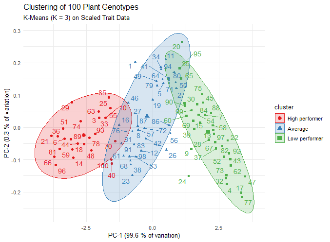

# 🌾 Plant Genotype Phenotypic Analysis in R

> **Measuring 100 plant genotypes and turning trait data into selection decisions** 
> a step-by-step R workflow, from first look at the data to a live decision easy visuals.

*Abiotic Stress Breeder · Trait Selection · Reproducible Pipelines*

[Overview](#-dataset-overview) · [Modules](#-project-modules) · [Workflow](#-workflow-pipeline)

---

## 📊 Dataset Overview

Phenotypic data recorded for **100 plant genotypes** (`G1` – `G100`).
Each genotype is described by one ID and five measured/scored traits:

### 📋 Recorded Variables

| Variable | What it means |
|:---:|---|
| `Genotype` **Genotype ID** | Unique code given to each plant line (`G1` – `G100`) |
| `L` **Length** | Total plant length (height), base to tip in **cm** |
| `B` **Breadth** | Canopy width at its widest point in **cm** |
| `SL` **Shoot Length** | Length of the above-ground shoot in **cm** |
| `RL` **Root Length** | Length of the primary root system in **cm** |
| `LC` **Leaf Colour** | Visual score: *Light Green · Green · Dark Green* |

> 💡 **Field note:** `SL` and `RL` are the standard abbreviations used in seedling-vigor
> research, and `LC` is typically scored against a **Leaf Colour Chart (LCC)** 
> a simple, visual standard developed by IRRI.

---

## 🗂️ Project Modules

Five numbered scripts runnig them in order, each one builds on the previous data.

| SR | Project name | Script name | What it does (in plain words) | Packages |
|:-:|--------|--------|-------------------------------|----------|
| 1 | **Exploratory Data Analysis** | [`exploratory_data_analysis`] | summary stats, correlations, bar & scatter plots | `readxl` `dplyr` `ggplot2` |
| 2 | **ANOVA & Post-Hoc Test** | [`anova_and_posthoc`] | Checks if genotypes truly differ (One-Way ANOVA) and ranks them (Duncan's Test); exports `.png` boxplots | `agricolae` |
| 3 | **Linear Regression** | [`linear_regression`] | Predicts one trait from another, reports R² and residual offsets diagnostics | `stats` `ggplot2` |
| 4 | **Clustering & PCA** | [`genotype_clustering_pca`] | Scales traits (Z-score), groups similar genotypes (K-Means, K = 3), visualizes with PCA biplots | `factoextra` `stats` |
| 5 | **Shiny Dashboard** | [`shiny_dashboard`] | A web app to filter and plot traits — no coding needed to explore | `shiny` `dplyr` `ggplot2` |

### ❓ The Question Each Step Answers

| Step | Question |
|:---:|---|
|  `1` | *What does my data look like?* |
|  `2` | *Are the genotypes really different and which ones are the best?* |
|  `3` | *Can one trait predict another?* *(indirect selection)* |
|  `4` | *Which genotypes are alike and which are diverse enough for crossing?* |
|  `5` | *Can I explore the results without writing code?* |

---

## 🔁 Workflow Pipeline

---
## 📈 Project Results & Showcase
### 4️⃣ Grouping Genotypes by K-Means Clustering & PCA

**Script:** [`04_genotype_clustering_pca.R`](./result/04_genotype_clustering_pca.R)

**Description:**

This module groups the 100 genotypes into clusters based only on their physical measurements (`L`, `B`, `SL`, `RL`) — no labels are given to the algorithm. Traits are first **standardized (Z-score scaling)**, then **K-Means (K = 3)** assigns each genotype to a group, and **PCA** compresses the four traits into two axes so the groups can be visualized (`α` n.a. — unsupervised method).

---

#### 📊 Results & Outputs

##### K-Means Cluster Assignment

*Shows:* How many genotypes fall into each of the three clusters (seed fixed at 123 for reproducibility)

**📄 Full Report:** [Download the complete clustering & PCA output (PDF)](./results/genotype_clustering_pca.pdf)

| Cluster | Genotypes (n) | Share of panel |
|---|:-:|:-:|
| Cluster 1 | 36 | 36% |
| Cluster 2 | 37 | 37% |
| Cluster 3 | 27 | 27% |

**Key Findings:**

- K-Means separated all 100 genotypes into **three groups of similar size** — 36, 37 and 27 members
- Group sizes are nearly balanced, meaning no single cluster dominates the panel

---

##### PCA — Where the Variation Lives

*Shows:* How much of the total trait variation each principal component captures

| Component | Std. Deviation | Variance Explained | Cumulative |
|---|:-:|:-:|:-:|
| PC1 | 1.996 | **99.6%** | 99.6% |
| PC2 | 0.101 | 0.3% | 99.9% |
| PC3 | 0.056 | 0.1% | 100.0% |
| PC4 | 0.041 | < 0.1% | 100.0% |

**Key Findings:**

- **PC1 alone carries 99.6% of all variation** — almost everything that differs between genotypes sits on one axis
- This one axis represents **overall plant size (vigour)**: genotypes differ mainly in *how big* they are, not in their shape

---

##### Cluster Trait Profiles

*Shows:* Average value of each trait per cluster — used to label what each group actually is

| Cluster | n | `L` (cm) | `B` (cm) | `SL` (cm) | `RL` (cm) | Performance tier |
|---|:-:|:-:|:-:|:-:|:-:|---|
| Cluster 3 | 27 | **96.43** | **9.48** | **67.72** | **30.40** |  High performers |
| Cluster 1 | 36 | 90.31 | 8.43 | 62.91 | 28.03 |  Average |
| Cluster 2 | 37 | 84.29 | 7.49 | 58.24 | 25.52 |  Low performers |

**Key Findings:**

- The clusters are **consistently ranked on every trait** — Cluster 3 is largest everywhere, Cluster 2 is smallest everywhere
- High performers exceed low performers by **~14% in Length** and **~19% in Root Length**
- Cluster numbering from K-Means is arbitrary — the tiers above are assigned from the **mean trait values**

---

##### PCA Cluster Plot

*Shows:* Two-dimensional PCA view of the three clusters with concentration ellipses (300 dpi)

**Interpretation:**

- The three groups are **clearly separated along PC-1**, from the smallest genotypes to the largest
- Ellipses overlap only slightly at the borders, indicating the clusters are **well defined**
- Because PC-2 explains just 0.3%, the vertical spread carries almost no biological information

---

#### 🔍 Key Insights from Project 4:

1. **Three natural genotype groups exist:** without using any labels, K-Means divided the 100 genotypes into three size-based clusters (36 / 37 / 27 members) that differ on all four traits.
2. **Variation is essentially one-dimensional:** PC1 captures 99.6% of all trait variation, so genotypes differ almost entirely in overall size — a single vigour axis.
3. **The performance gap is agronomically meaningful:** the 27 high-performing genotypes outperform the low group by ~14% in length and ~19% in root length — matching the effect sizes seen in Projects 2 and 3.
4. **Caveats to report:** cluster borders overlap slightly, K-Means numbering is arbitrary (tiers must be assigned from trait means), and with such correlated traits PCA cannot separate size from shape.
5. **Basis for further analysis:** these performance tiers give the selection targets that are explored interactively in the Shiny dashboard (Project 5).

